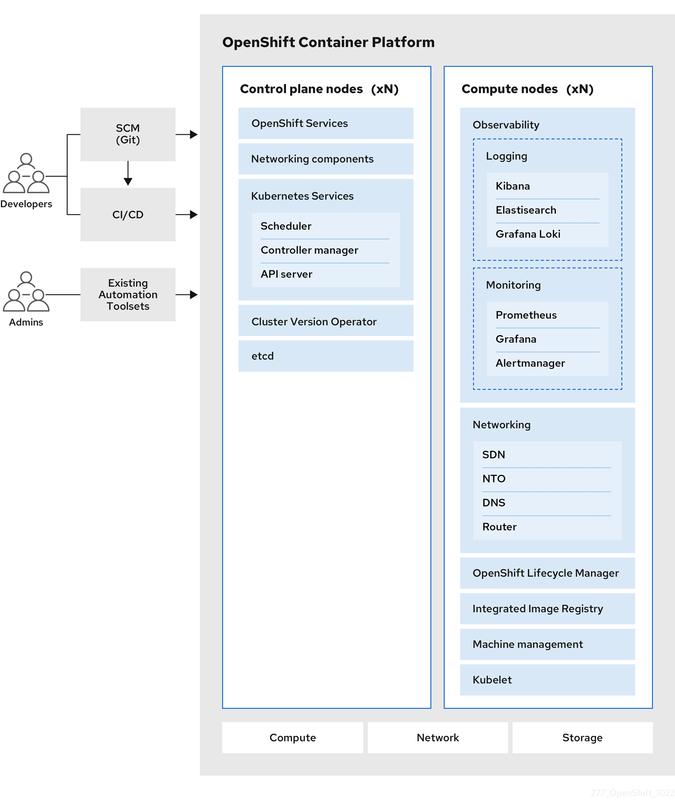
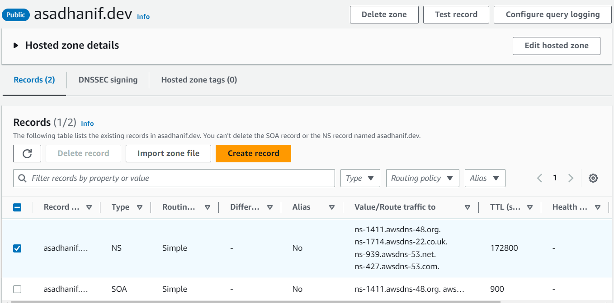
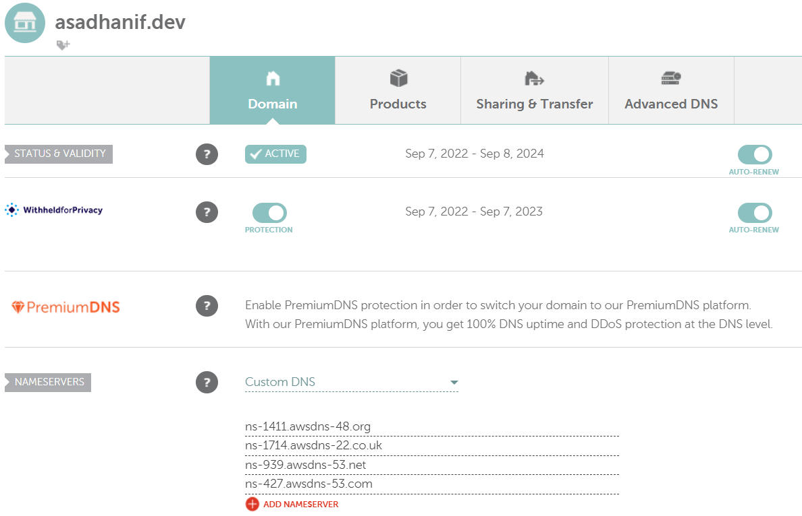

# Red Hat OpenShift Notes

## Description
Red Hat OpenShift is an open-source container application platform for developing and hosting enterprise-grade applications. OpenShift is Red Hat's Platform as a Service (PaaS) offering. Once deployed, OpenShift takes care of managing the underlying infrastructure components, thereby enabling the developers to do what they do best: code. 

One of the key features of OpenShift is its ability to simplify the process of deploying and scaling applications. With OpenShift, developers can easily create application images and deploy them to the platform, which will automatically manage the container environment, including scaling and load balancing.

OpenShift also provides a number of tools for managing the container environment, including monitoring and logging tools, as well as tools for managing access and security. Additionally, OpenShift supports a wide range of programming languages and frameworks, making it a flexible platform for building and deploying applications.

Some of the other features of OpenShift include:
- Self-service application deployment: Developers can easily deploy applications to OpenShift without needing to go through a centralized IT team.
- Built-in security: OpenShift includes a number of security features, including secure container images and integrated authentication and authorization.
- Multi-cloud support: OpenShift can be deployed on a variety of infrastructure, including on-premises data centers, public clouds, and hybrid clouds.
- Community support: OpenShift has a large and active community of users and contributors, providing a wealth of resources and support for developers.

OpenShift has **four** different flavors:
1. **OpenShift Origin**: Open source application container platform. 
2. **OpenShift Online**: It is Red Hat's publically hosted version of OpenShift Origin, available for application development and hosting purposes. 
3. **OpenShift Dedicated**: It is a managed private cluster on cloud platforms like AWS and Google.  
4. **OpenShift Enterprise**: OpenShift Enterprise is on-premise, private PaaS offering of OpenShift. 

**OpenShift Origin** is based on top of **Docker** containers and the **Kubernetes** cluster manager, with added developer and operational centric **Tools** that enable rapid application development, deployment and lifecycle management. 

**Docker**: Docker in the fundamental technology that powers the development of containerized applications in the form of resuable images. Docker enables us to create an image of our application, with all the required dependencies prepackaged into images that can be instantly deployed in any environment.  

**Kubernetes**: Kubernetes powers deployment and management of these Docker images across large clusters by providing *self-healing* and *autoscaling* features. 

**Tools**: OpenShift builds on these technologies by providing a layer of tools that abstract the underlying Kubernetes and infrastructure management tasks to help developers easily deploy and manage their applications on the Kubernetes-based infrastructure. 
- OpenShift adds support for developer tools such are built-in integration of with source code management (SCM) software lke GitHub. 
- OpenShift has built-in integration with build pipelines that helps developers rapidly and consistently develop, build, test and deploy applications. 
- OpenShift helps manage Docker images of your application by providing a built-in registry. 
- OpenShift comes with support for software-defined network (SDN) that provides networking capabilities out of the box. 
- OpenShift is API-centric and has a rich and well documneted set of APIs that helps us easily integrate OpenShift with our existing infrastructure. 
- OpenShift provides out-of-box support for projects, teams, and users to organiza and manage access to applications.

## Glossary of common terms for OpenShift Container Platform
This glossary defines common Kubernetes and OpenShift Container Platform terms. 

[Documentation Reference](https://docs.openshift.com/container-platform/4.10/getting_started/openshift-overview.html)

### Kubernetes
Kubernetes is an open source container orchestration engine for automating deployment, scaling, and management of containerized applications.

### Containers
Containers are application instances and components that run in OCI-compliant containers on the worker nodes. A container is the runtime of an Open Container Initiative (OCI)-compliant image. An image is a binary application. A worker node can run many containers. A node capacity is related to memory and CPU capabilities of the underlying resources whether they are cloud, hardware, or virtualized.

### Pod
A pod is one or more containers deployed together on one host. It consists of a colocated group of containers with shared resources such as volumes and IP addresses. A pod is also the smallest compute unit defined, deployed, and managed.

In OpenShift Container Platform, pods replace individual application containers as the smallest deployable unit.

Pods are the orchestrated unit in OpenShift Container Platform. OpenShift Container Platform schedules and runs all containers in a pod on the same node. Complex applications are made up of many pods, each with their own containers. They interact externally and also with another inside the OpenShift Container Platform environment.

### Replica set and Replication Controller
The Kubernetes replica set and the OpenShift Container Platform replication controller are both available. The job of this component is to ensure the specified number of pod replicas are running at all times. If pods exit or are deleted, the replica set or replication controller starts more. If more pods are running than needed, the replica set deletes as many as necessary to match the specified number of replicas.

### Deployment and DeploymentConfig
OpenShift Container Platform implements both Kubernetes Deployment objects and OpenShift Container Platform DeploymentConfigs objects. Users may select either.

Deployment objects control how an application is rolled out as pods. They identify the name of the container image to be taken from the registry and deployed as a pod on a node. They set the number of replicas of the pod to deploy, creating a replica set to manage the process. The labels indicated instruct the scheduler onto which nodes to deploy the pod. The set of labels is included in the pod definition that the replica set instantiates.

Deployment objects are able to update the pods deployed onto the worker nodes based on the version of the Deployment objects and the various rollout strategies for managing acceptable application availability. OpenShift Container Platform DeploymentConfig objects add the additional features of change triggers, which are able to automatically create new versions of the Deployment objects as new versions of the container image are available, or other changes.

### Service
A service defines a logical set of pods and access policies. It provides permanent internal IP addresses and hostnames for other applications to use as pods are created and destroyed.

Service layers connect application components together. For example, a front-end web service connects to a database instance by communicating with its service. Services allow for simple internal load balancing across application components. OpenShift Container Platform automatically injects service information into running containers for ease of discovery.

### Route
A route is a way to expose a service by giving it an externally reachable hostname, such as www.example.com. Each route consists of a route name, a service selector, and optionally a security configuration. A router can consume a defined route and the endpoints identified by its service to provide a name that lets external clients reach your applications. While it is easy to deploy a complete multi-tier application, traffic from anywhere outside the OpenShift Container Platform environment cannot reach the application without the routing layer.

### Build
A build is the process of transforming input parameters into a resulting object. Most often, the process is used to transform input parameters or source code into a runnable image. A BuildConfig object is the definition of the entire build process. OpenShift Container Platform leverages Kubernetes by creating containers from build images and pushing them to the integrated registry.

### Project
OpenShift Container Platform uses projects to allow groups of users or developers to work together, serving as the unit of isolation and collaboration. It defines the scope of resources, allows project administrators and collaborators to manage resources, and restricts and tracks the user’s resources with quotas and limits.

A project is a Kubernetes namespace with additional annotations. It is the central vehicle for managing access to resources for regular users. A project lets a community of users organize and manage their content in isolation from other communities. Users must receive access to projects from administrators. But cluster administrators can allow developers to create their own projects, in which case users automatically have access to their own projects.

Each project has its own set of objects, policies, constraints, and service accounts. **Projects are also known as namespaces**.

## OpenShift Container Platform architecture
OpenShift Container Platform is a platform for developing and running containerized applications. It is designed to allow applications and the data centers that support them to expand from just a few machines and applications to thousands of machines that serve millions of clients.

With its foundation in Kubernetes, OpenShift Container Platform incorporates the same technology that serves as the engine for massive telecommunications, streaming video, gaming, banking, and other applications. Its implementation in open Red Hat technologies lets you extend your containerized applications beyond a single cloud to on-premise and multi-cloud environments.

[Doc Ref](https://docs.openshift.com/container-platform/4.10/architecture/architecture.html)

### OpenShift Container Platform overview
OpenShift Container Platform provides enterprise-ready enhancements to Kubernetes, including the following enhancements:
- Hybrid cloud deployments. You can deploy OpenShift Container Platform clusters to a variety of public cloud platforms or in your data center.
- Integrated Red Hat technology. Major components in OpenShift Container Platform come from Red Hat Enterprise Linux (RHEL) and related Red Hat technologies. OpenShift Container Platform benefits from the intense testing and certification initiatives for Red Hat’s enterprise quality software.
- Open source development model. Development is completed in the open, and the source code is available from public software repositories. This open collaboration fosters rapid innovation and development.

Although Kubernetes excels at managing your applications, it does not specify or manage platform-level requirements or deployment processes. Powerful and flexible platform management tools and processes are important benefits that OpenShift Container Platform 4.10 offers. The following sections describe some unique features and benefits of OpenShift Container Platform.

### OpenShift Container Platform lifecycle
The following figure illustrates the basic OpenShift Container Platform lifecycle:
- Creating an OpenShift Container Platform cluster
- Managing the cluster
- Developing and deploying applications
- Scaling up applications

## Getting Started with OpenShift

### Installation Methods - OpenShift
First of all create RedHat [account](https://www.redhat.com/wapps/ugc/register.html?_flowId=register-flow&_flowExecutionKey=e1s1). 

### Install - Single Node using CRC 
Got to [console.redhat.com/openshift](http://console.redhat.com/openshift), and install code-ready containers (CRC). It is just like Docker Desktop. It just sits locally, it's in task bar, we can open it up. We can use OpenShift locally just on like a dev style cluster, e.g. Docker Desptop, Minikube, etc. Click on create cluster, from the poratl, and choose local option and follow the steps of installation. 

CodeReady Containers (CRS) exhibits following properties:
1. Runs in a Single VM
    - Bring a minimal OpenShift 4 cluster to laptop/desktop for development and testing.
2. Easy Setup
    - The CRC CLI makes it east to install and interact with the VM.
    - It also allows for easy configuration. 
3. It is Ephemeral
    - Since it is ephemeral, it is not good to use it in a production environment. 
    - Good for learning and developing bit not for production-level apps and services. 

#### Pre-Requisites to setup CRC

**Hardware Requirements** 
1. Needs 4 virtual CPUs (vCPUs)
2. Needs 9 GB free memory (RAM)
3. Need 35 GB free storage

**Operating System Requirements** 
1. Windows: 
    - Windows 10 Pro or newer 
2. macOS: 
    - macOS 10.12 Sierra or newer 
3. Linux:
    - RHEL/CentOS 7.5 or newer
    - Fedora - 2 latest stable releases
    - Ubuntu 18.04 LTS
    - Debian 10 or newer 

**Required SOftware Packages** 

| Linux Distributions | Installation Commands |
|---------|-----------|
| Fedora | `sudo dnf install NetworkManager` |
| RHEL/CentOS | `su -c 'yum install NetworkManager'` |
| Debian/Ubuntu | `sudo apt install qemu-kvm libvirt-daemon libvirt-daemon-system network-manager` |

#### Installation Steps

**Step 1:** Download the latest release. Extract the contents somewhare in PATH. 

**Step 2:** Setup CodeReady Containers using `crc setup` command. 

**Step 3:** Start CodeReady Containers using `crc start` command. 

#### Upgrade CodeReady Containers Steps

**Step 1:** Download the latest release. Extract the contents somewhare in PATH. 

**Step 2:** Delete the existing VM using `crc delete` command. 

**Step 3:** Replace CRC binary and verify using `crc version` command. 

**Step 4:** Setup CodeReady Containers using `crc setup` command. 

**Step 5:** Start CodeReady Containers using `crc start` command. 

### Install - Multi-Node CLuster 
The portal has two sections, the **developer** and the **administrator**. There is the observability piece of OpenShift wher we can see metrics, alerts, events, etc. 

There is a **Project** section, we can think of a project like a namespace in Kubernetes.  

There is OpenShift Command Line Interface, i.e. known as `oc`, option avaliable to run different commands. 
To see list of Pods, run the command:

`oc get pods`

**Note:** In OpenShift `oc` mimics the `kubectl` of K8s. 

# Openshift Concepts

## Projects and Users
A large Kubernetes cluster can host lots of Pods in hundreds of deployments with various services and endpoints configured. The same large infrastructure can be shared by various teams working on different applications. Sharing the same infrastructure with different teams, however, may not be a good idea as there are no restrictions as to who can access what resources since the entire platform is shared between different teams. Users will also need to coordinate on the names they use for their applications, as this setup does not allow for two users to create a deployment or serice with the same name. 

A project in OpenShift allow users to organize and manage their contents in the OpenShift environment. It helps teams isolate their work from other teams sharing the same infratructure. It allows us to manage access to resources for various users. Projects are built on top of Kubernetes constructs known as namespaces. Using namespaces, K8s automatically prefixes a name of our choice to the objects we create in our namespace, thereby providing some basic grouping functionality for resources. OpenShift projects builds on this functionality to provide complete grouping and isolation of resources that is seamless to users. The user simple creates a project and deploys the application and no longer worry about managing namespaces underneath. All of that is taken care by OpenShift automatically. 

OpenShift comes with built-in user management features. There are three types of users available:
1. Regular User
2. System User
3. Service Accounts

#### 1. Regular User

Regular user are developers and others who interact with OpenShift for developing and deploying applications on a regular basis. They so simple by the name of the users, such as *`developer`*. 

#### 2. System User

System useras are used for interacting with the inftrastructure, such as cluster administrator or a user created for each node in the cluster. OpenShift creates some of these users by default, such as the *`system admin`* and *`system master`* users. 
Note that system users can be identified by a system prefix on the usernames. 

#### 3. Service Accounts
They are created as needed for each project. These user accounts are for enabling communication between various services within our application, for example, an account used by the web server for accessing the database. 

Service accounts have a prefix of system service account on the usernames, e.g. `system:serviceaccount:projj1:db_user`. OpenShift master includes a built-in OAuth server that is responsible for authenticating and authorizating users into the OpenShift cluster. For All in One mode of setup, such as the one we deployed with minishift, the default OAuth configuration is set to an *Allow All* identity provider, that allows any user to log in with any password. If the user doesn't exist with the system, it is automatically created when the user tries to log in for the first time. The password is never varified in this setup. In case of advanced installation, the *Deny All* provider is used, and this denies access for all users. The administrator then needs to manually create and enable new users. This behavior can be changed by modifying the master configuration file, located at `/etc/openshift/master/master-config.yaml`. 

### Creating Users 
Log into the CLI using the `OC login` command. 

`oc login -u system:admin` 

**Note:** `system:admin` is the username. 

To see the list of project, use following command. 

`oc get projects`

To see the list of user, use following command. 

`oc get users`

To assign `cluster-admin` role to `administrator` user, use following command. 

`oc adm policy add-cluster-role-to-user cluster-admin administrator`

## OpenShift vs. K8s Components 
OpenShift is an orchestrator that gives us the ability to control anything from users, projects, which are just namespaces in Kubernetes, application deployments, services, routes, ingress, builds, we have the console to control things with, also the CLI to control things with. 

So that is the difference between OpenShift and Kubernets? 

With Kubernetes, we as a user interact directly with K8s API server, because there are many different APIs and different ways to extend the API landscape it comes to Kubernetes. With OpenShift, we have all of these components, i.e. control place, ETCD, Pods, Deployments, etc. OpenShift actually running k8s in the background. The user interacting with OpenShift, and then OpenShift send request from a user to Kubernetes. So, OpenShift is the platform that sits on top of Kubernetes. Kubernetes is abstracted away from the user. That's why OpenShift is considered PaaS, because user interact directly to OpenShift.  

## Deployment and a DeploymentConfig
In OpenShift, a Deployment and a DeploymentConfig are two different types of objects used to manage the deployment of containerized applications.

A Deployment is a Kubernetes object that describes a set of replicas of a containerized application that should be running at any given time. When you create a Deployment, you specify the container image to use, the number of replicas to create, and other settings related to the application's deployment.

A DeploymentConfig, on the other hand, is a custom object that is specific to OpenShift. It is similar to a Deployment in that it describes a set of replicas of a containerized application, but it includes additional features that are specific to OpenShift. For example, a DeploymentConfig can include triggers that cause the application to be redeployed based on changes to the source code, configuration settings, or other parameters.

Another difference between Deployments and DeploymentConfigs is the way they handle updates. With Deployments, updates to the container image or other settings trigger a rolling update, which updates the replicas of the application one at a time to minimize downtime. With DeploymentConfigs, updates are typically done using a strategy called a rolling deployment, which updates the replicas of the application in a more controlled and customizable way.

In general, Deployments are a more basic Kubernetes object that provide a simple way to manage the deployment of containerized applications, while DeploymentConfigs are a more advanced OpenShift-specific object that provides additional features and customization options.

## Build and a BuildConfig
At a hight level a build essentially takes code and transforms that code into a container image. We can use that container image and can run it across entire application process, whether it's frontend, middleware and backend. We write that code, then that code gets transformed into a build so that build can be a container images. 

This is same thing as, for example, having a Dockerfile, and when we run `docker build` command and it creates that container image. That's a container image creation process, very much the same as an OpenShift build. 

Now, a build config is the actual configuration that takes place to take that source code and create a container image of it. Typically, these build configs are automatically created for us via a build strategy. This build config file is typically created automatically, so we don't have to manually create it.  

## Routes
As a user we need to access any application via URL. In OpenShift, that's exactly what our route is done. 

**Definition**
A route is exposing a service that's running inside of OpenShift to a hostname. For example Google was running on OpenShift, we want to access at www.google.com. Google would have some containers running inside of OpenShift ant those containers, or Pods, rather, would be pointing to some type of service and that service would then be exposed to the world so people can read Google. 

From a Kubernetes prespective, this is pretty much the same thing as setting us a Load Balancer in from of our service, so we can access it via the Load Balancer IP or the Load Balancer hostname or any DNS name. 

## Build Configuration Strategy 
There are **four** strategies to create the build configuration. 

[Documentation Reference](https://docs.openshift.com/container-platform/4.12/cicd/builds/build-strategies.html) 

1. **Source-to-Image (S2I) build:** 
    - Source-to-image (S2I) is a tool for building reproducible container images. 
    - It produces ready-to-run images by injecting application source into a container image and assembling a new image. 
    - The new image incorporates the base image, the builder, and built source and is ready to use with the buildah run command. 
    - S2I supports incremental builds, which re-use previously downloaded dependencies, previously built artifacts, and so on.
  
2. **Pipeline build:**
    - The Pipeline build strategy allows developers to define a Jenkins pipeline for use by the Jenkins pipeline plugin. 
    - The build can be started, monitored, and managed by OpenShift Container Platform in the same way as any other build type.
    - Pipeline workflows are defined in a `jenkinsfile`, either embedded directly in the build configuration, or supplied in a Git repository and referenced by the build configuration.
    - Pipelines give us control over building, deploying, and promoting our applications on OpenShift Container Platform. 
    - Using a combination of the Jenkins Pipeline build strategy, `jenkinsfiles`, and the OpenShift Container Platform Domain Specific Language (DSL) provided by the Jenkins Client Plugin, we can create advanced build, test, deploy, and promote pipelines for any scenario.

3. **Docker build:**
    - OpenShift Container Platform uses **_Buildah_** to build a container image from a Dockerfile.
    - Docker is just like the Docker build command, which used Dockerfile. 
    - With this strategy, it is going to expect a Dockerfile in the sampe repo as the code. 
4. **Custom build:**
    - The custom build strategy allows developers to define a specific builder image responsible for the entire build process. 
    - Using our own builder image allows us to customize our build process.
    - A custom builder image is a plain container image embedded with build process logic, for example for building RPMs or base images.
    - Custom builds run with a high level of privilege and are not available to users by default. 
    - Only users who can be trusted with cluster administration permissions should be granted access to run custom builds.
    - It's a plain Docker-formatted container image embedded with build process logic. 

### Build Input
The build configuration is going to come **build input**. Following are Build Inputs of build config:
1. **Git:** Any type of Git source control system where code exists. 
2. **Dockerfile:** We can use a Dockerfile for our build configuration. 
3. **Binary:** It pulls a binary from a local file system. 
4. **Image:** An image source, those as just additional files that can be provided for the build image process. It feals more or less identical to a Dockerfile. We can specifiy images, their tags, ans where they can be referenced from. 
5. **Input Secrets:** If we're building something and it requires specific credentials or some type of other configuration to access dependent resources based on secrets, or config maps. We can define a secrets input so our application can do any type of authentication, authorization that it ultimate;y needs. 
6. **External Artifacts:** We used to take binaries like a Java jar, and we used to pop it onto a server and then we used to run Java jar command that would bring up our application and binary. 

<!-- 
## Installing an OpenShift cluster on AWS with customizations
In OpenShift Container Platform version 4.12, we can install a customized cluster on infrastructure that the installation program provisions on Amazon Web Services (AWS). To customize the installation, we need to modify parameters in the `install-config.yaml` file before installing the cluster.

### Pre-Requisites
Following prerequisites must be met before OpenShift cluster provisioning.
- Configure an **AWS account** to host the cluster.
- An **IAM user** with **Admin access**.  
- An **installer machine** to start the provisioning step. 
    - We can have a Virtual Machine on AWS acting as installer machine. 
- A **Domain name** to access the application deployed on OpenShift cluster.
- A RedHat account. 

### Step 1: Create a Public Hosted Zone using the Route 53 
I have already acquired domain name, i.e. **asadhanif.dev**, from Namecheap, Inc. 

Sign in to the **AWS Management Console** and open the **Route 53 console** at https://console.aws.amazon.com/route53/.

In the Create Hosted Zone pane, enter the name of the domain to route traffic for. Following image is presenting the created public hosted zone. 

Next step is to update the DNS records at Namecheap. 

 
-->

